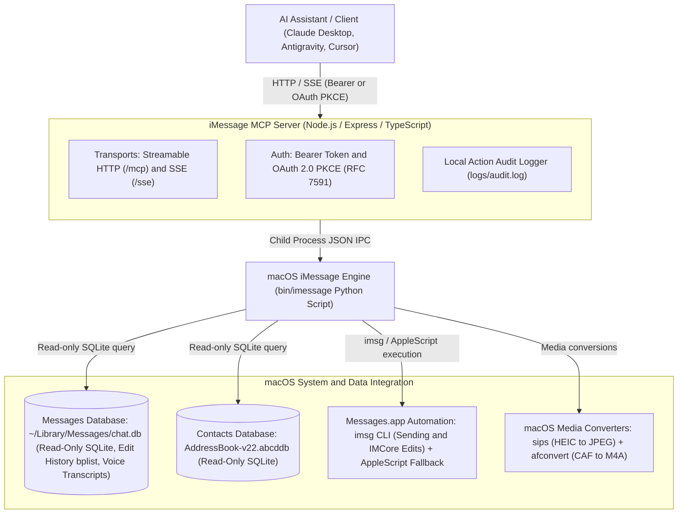

# iMessage MCP Server

[](LICENSE)
[](package.json)
[](https://modelcontextprotocol.io)

An enterprise-grade Model Context Protocol (MCP) Server for macOS iMessage integration over Streamable HTTP and SSE transports.

It connects your local Mac's iMessage database (`~/Library/Messages/chat.db`), macOS Contacts (`AddressBook`), and Swift/AppleScript automation capabilities directly to AI assistants (Antigravity, Claude Desktop, Cursor, Gemini CLI, etc.) running locally or over secure tunnels (Cloudflare Tunnel, Tailscale).

---

## Features

- **Dual MCP Transports:** Supports modern Streamable HTTP (`/mcp`) and Server-Sent Events (`/sse`).
- **Full-Text Message Search:** Instant SQLite query across historical iMessage text and rich attributed bodies.
- **Message Rewrite & Edit History:** Surfaces edit status indicators (`is_edited`, `has_edits`, `edit_count`, `last_edited`) on pulled messages, decoding binary property lists (`message_summary_info`) in `chat.db` for full chronological revision histories.
- **Message Editing:** Programmatically edit sent messages within Apple's 15-minute protocol window (up to 5 revisions) via `imessage_edit_message` and `imessage edit`, routing through the IMCore bridge.
- **Contact Resolution:** Integrates with macOS Contacts database (`AddressBook-v22.abcddb`) to resolve names, phone numbers, and emails.
- **Voice Note Transcriptions & Audio Processing:** Surfaces Apple on-device speech-to-text transcriptions, audio durations (e.g. `[voice note, 15s: "transcript"]`), and full-text search across voice memo transcripts. Automatically converts proprietary CoreAudio `.caf` files to universal `.m4a` (AAC) via macOS `afconvert` for speech and multimodal AI models.
- **Multimodal Attachment Reading:** Exposes attachment metadata (MIME type, size, path, duration) and automatically converts `.heic` photos to `.jpg` and `.caf` voice memos to `.m4a`.
- **Reliable Attachment Sending:** Sends route through the [imsg](https://github.com/openclaw/imsg) CLI when installed, with a native AppleScript fallback that stages files inside Messages' own attachments directory to avoid "Not Delivered" sandboxing failures. No Accessibility/GUI scripting required.
- **Group Chat Rosters:** Inspects group conversation member lists and handles.
- **OAuth 2.0 Auth Server & Bearer Auth:** Embedded authorization server supporting RFC 8414 metadata, Authorization Code flow with PKCE, Client Credentials grant, and RFC 7591 dynamic client registration alongside customizable static Bearer tokens.

---

## Architecture Overview



```
┌─────────────────────────┐          HTTP / SSE           ┌──────────────────────────────────┐
│  AI Assistant / Client  │  ───────────────────────────> │       iMessage MCP Server        │
│  (Claude, Antigravity)  │  <── Authorization: Bearer ── │     (Node.js / Express / TS)     │
└─────────────────────────┘                               └─────────────────┬────────────────┘
                                                                            │
                                                                            │ Child Process (JSON IPC)
                                                                            ▼
                                                          ┌──────────────────────────────────┐
                                                          │        macOS iMessage CLI        │
                                                          │   (bin/imessage Python Script)   │
                                                          └─────────────────┬────────────────┘
                                                                            │
                            ┌───────────────────────────────────────────────┼───────────────────────────────────────────────┐
                            │                                               │                                               │
                            ▼                                               ▼                                               ▼
             ┌──────────────────────────────┐                ┌──────────────────────────────┐                ┌──────────────────────────────┐
             │   Messages DB (Read-Only)    │                │   Contacts DB (Read-Only)    │                │   Messages.app Automation    │
             │  ~/Library/Messages/chat.db  │                │    AddressBook-v22.abcddb    │                │    imsg CLI + AppleScript    │
             │ • History & Edit bplists     │                │ • Contact & Name Resolution  │                │ • Sending & IMCore Edits     │
             │ • Voice Memo Transcriptions  │                │                              │                │ • sips / afconvert tools     │
             └──────────────────────────────┘                └──────────────────────────────┘                └──────────────────────────────┘
```

---

## Prerequisites

- **Host Machine:** macOS 12 (Monterey), 13 (Ventura), 14 (Sonoma), or 15 (Sequoia).
- **Node.js:** `>=24.0.0` (Active LTS).
- **Package Manager:** `pnpm` (`npm install -g pnpm`).
- **Python:** Python 3.9+ (built-in macOS python3 or Homebrew).
- **Messages App:** Signed into an active Apple ID / iMessage account.

---

## Installation & Setup Guide

### 1. Clone & Install Dependencies

```bash
git clone https://github.com/genericService/imessage-mcp-server.git
cd imessage-mcp-server
pnpm install
```

### 2. Configure Environment & Bearer Token

Create a `.env` file in the project root:

```bash
cp .env.example .env
```

Edit `.env` to set your desired port and a strong random Bearer token:

```env
PORT=8765
AUTH_TOKEN=your-secure-random-bearer-token-here
USE_HTTPS=false
```

### 3. Grant macOS TCC & System Permissions

Due to macOS privacy safeguards (TCC), the process executing the server requires Full Disk Access and Accessibility permissions.

#### A. Full Disk Access (Required to read `chat.db`)
1. Open **System Settings → Privacy & Security → Full Disk Access**.
2. Enable the toggle for **Terminal** (or **sshd-daemon** if running remotely over SSH).

#### B. Automation (Required for sending and editing)
1. Open **System Settings → Privacy & Security → Automation** and ensure **Terminal** / **sshd** has permission to control **Messages**.
2. (Recommended) Install the [imsg](https://github.com/openclaw/imsg) CLI for the primary send path: `brew install steipete/tap/imsg`. Without it, sends fall back to native AppleScript with sandbox-safe attachment staging. Note: `imsg` also powers the private IMCore bridge into Messages.app for editing sent messages.

### 4. Build & Start Server

```bash
# Build TypeScript
pnpm build

# Run in production mode
pnpm start
```

---

## Client Configuration (`mcp_config.json`)

To connect an AI client (Antigravity, Cursor, Claude Desktop, etc.) to the iMessage MCP server:

### 1. Native Direct HTTP Transport (Recommended)

Modern MCP clients support direct HTTP / SSE transport definitions with custom headers (Bearer token & Cloudflare Access tokens) without any external bridge process:

```json
{
  "mcpServers": {
    "imessage": {
      "url": "https://imessage.genericservice.app/mcp",
      "headers": {
        "Authorization": "Bearer YOUR_AUTH_TOKEN",
        "CF-Access-Client-Id": "YOUR_CLIENT_ID.access",
        "CF-Access-Client-Secret": "YOUR_CLIENT_SECRET"
      }
    }
  }
}
```

### 2. Local Network (Direct HTTP)

```json
{
  "mcpServers": {
    "imessage": {
      "url": "http://localhost:8765/mcp",
      "headers": {
        "Authorization": "Bearer YOUR_AUTH_TOKEN"
      }
    }
  }
}
```

### 3. Legacy `mcp-remote` Stdio Bridge (Optional)

If your client only supports `stdio` command execution:

```json
{
  "mcpServers": {
    "imessage": {
      "command": "pnpm",
      "args": [
        "dlx",
        "mcp-remote",
        "https://imessage.genericservice.app/mcp",
        "--header",
        "Authorization: Bearer YOUR_AUTH_TOKEN"
      ],
      "trust": true
    }
  }
}
```

---

## OAuth 2.0 Auth Server (CLI & Online Agents)

The server embeds a native **OAuth 2.0 Authorization Server** supporting RFC 8414 metadata, Client Credentials grant, and Authorization Code grant with PKCE for CLI tools (Claude Code, Antigravity CLI, Codex) and online services (ChatGPT Actions, custom GPTs, web apps).

### 1. Server Metadata Endpoint
* **Discovery URL:** `https://imessage.genericservice.app/.well-known/oauth-authorization-server`
* **Authorization Endpoint:** `https://imessage.genericservice.app/oauth/authorize`
* **Token Endpoint:** `https://imessage.genericservice.app/oauth/token`
* **Registration Endpoint:** `https://imessage.genericservice.app/oauth/register`

### 2. Zero-Config Client Connection (RFC 7591 Dynamic Registration)
Clients supporting RFC 7591 (such as Gemini Desktop or Cursor) connect automatically without requiring manually provisioned client IDs or secrets:
1. Provide the MCP server URL (`https://imessage.genericservice.app/mcp`) in the client.
2. The client discovers `registration_endpoint` and automatically registers its own identity using PKCE (`token_endpoint_auth_method: none`).
3. The client opens your browser to `/oauth/authorize` for logon approval.

### 3. Browser Logon & Session Persistence
The authorization endpoint provides a browser logon screen:
* Log in with `AUTH_USERNAME` and `AUTH_PASSWORD` (or your master `BEARER_TOKEN`).
* Checking **"Remember this browser"** issues a signed, 30-day `HttpOnly` session cookie (`imessage_session`).
* Subsequent client connections from that browser only require a single **"Approve"** click without re-typing credentials.
* To clear sessions, navigate to `/oauth/logout`.

### 4. Client Credentials Token Exchange (CLI & Headless Agents)
Agents can exchange `client_id` and `client_secret` for a signed HS256 JWT access token:

```bash
curl -X POST https://imessage.genericservice.app/oauth/token \
  -H "Content-Type: application/json" \
  -d '{
    "grant_type": "client_credentials",
    "client_id": "antigravity-cli",
    "client_secret": "YOUR_SERVICE_SECRET"
  }'
```

Returns:
```json
{
  "access_token": "eyJhbGciOiJIUzI1Ni...",
  "token_type": "Bearer",
  "expires_in": 3600,
  "refresh_token": "ref_5ae1f64eb91...",
  "scope": "imessage:all"
}
```

---

## Available MCP Tools

| Tool Name | Description | Key Parameters |
| :--- | :--- | :--- |
| `imessage_list_chats` | List recent conversations with AddressBook names and participant sets | `limit` (number, default: 30) |
| `imessage_read_messages` | Read message history with inline attachment details, voice note audio transcriptions, durations, edit state indicators, and revision history | `chat` (string, required), `days` (number, default: 14), `since_message_id` (number, optional incremental polling threshold) |
| `imessage_get_recent_messages` | Preview last N messages to verify thread context, participants, voice note transcriptions, and edit history before sending | `chat` (string, required), `limit` (number, default: 5), `since_message_id` (number, optional incremental polling threshold) |
| `imessage_search_messages` | Full-text search across historical iMessages and voice note speech-to-text transcriptions | `query` (string, required), `limit` (number, default: 30) |
| `imessage_get_edit_history` | Retrieve full rewrite and edit history with revision timestamps for an iMessage by ROWID | `message_id` (number, required) |
| `imessage_search_group_chats` | Exact participant set search across group chats | `participants` (array of strings, required) |
| `imessage_search_contacts` | Search macOS Address Book by name, phone, or email | `query` (string, optional) |
| `imessage_get_chat_members` | List members and resolved contact names in group chats | `chat` (string, required) |
| `imessage_get_attachment_payload` | Fetch attachment metadata and base64 payload (converts HEIC to JPEG and CAF voice notes to M4A with transcriptions) | `path` (string, required) |
| `imessage_send_message` | Send iMessage to contact, group chat thread, or chat ROWID (supports dry_run preview & confirm_token) | `recipient` (string, required), `message`, `attachment`, `dry_run`, `confirm_token` |
| `imessage_edit_message` | Edit a previously sent message by ROWID (subject to 15-minute Apple protocol window and 5-edit limit) | `message_id` (number, required), `text` (string, required) |
| `imessage_get_readme` | Retrieve full server README documentation & usage guide | *(none)* |

---

## CLI Reference (`bin/imessage`)

The underlying Python engine can be executed directly as a standalone CLI for local administration, scripting, or automated pipelines. All commands support the `--json` flag for structured machine-readable output:

| Command | Description | Example |
| :--- | :--- | :--- |
| `list` | List recent conversations with participant handles | `bin/imessage list --limit 10 --json` |
| `read` | Read chat history for a contact or group chat | `bin/imessage read "+15550199808" --days 7 --since-id 202440` |
| `recent` | Preview last N messages in a conversation thread | `bin/imessage recent "+15550199808" --limit 5 --since-id 202440 --json` |
| `search` | Search message history by keyword or phrase | `bin/imessage search "Arrakis" --limit 20` |
| `edits` | Inspect complete rewrite and revision history for a message | `bin/imessage edits 198097 --json` |
| `edit` | Edit a previously sent outgoing message | `bin/imessage edit 198097 --text "Paul Atreides revised" --json` |
| `send` | Send message or attachment to contact or chat ID | `bin/imessage send "+15550199808" --message "Hello" --dry-run` |
| `contacts` | Search AddressBook contacts by name, email, or phone | `bin/imessage contacts "Paul Atreides" --json` |
| `members` | List members and handles in a group chat | `bin/imessage members 1767 --json` |
| `search-group` | Search group chats by exact participant set | `bin/imessage search-group "paul@caladan.org" "chani@sietch.net"` |
| `attachment` | Inspect attachment file metadata and base64 payload | `bin/imessage attachment "~/Library/Messages/Attachments/..."` |

---

## Security & Local Action Audit Logging

To maintain absolute privacy and trauma-informed data autonomy, the server **never** stores or logs personal message text, passwords, or attachment bytes.

If you wish to log AI agent action executions for security auditing, set `ENABLE_AUDIT_LOG=true` in your `.env` file. This appends structured JSON audit lines to `logs/audit.log`:

```json
{
  "timestamp": "2026-07-25T00:46:45Z",
  "tool": "imessage_send_message",
  "target": "Chani (+15550199480)",
  "dry_run": true,
  "status": "success",
  "duration_ms": 42
}
```

---

## Known Limitations & Considerations

1. **Host Mac Requirement:** Must run on a physical Mac or macOS VM signed into an active Apple ID.
2. **AppleScript Attachment Sandboxing:** Messages' sandbox blocks reading attachments from arbitrary paths (`/tmp`, `~/Desktop`, ...), which historically surfaced as "Not Delivered". This server avoids it by sending through the imsg CLI (which stages files itself), or in the AppleScript fallback by staging files under `~/Library/Messages/Attachments/imessage-mcp/` first (this folder is not pruned automatically). A logged-in user session is still required for Messages automation.
3. **Read-Only SQLite Access:** Database reads use `URI mode=ro` (`sqlite3.connect('file:chat.db?mode=ro', uri=True)`) to ensure `chat.db` is never locked or corrupted by server reads.
4. **SMS vs iMessage:** Text-only messages fallback gracefully to SMS if the recipient handle is a mobile phone number registered on your iPhone's Text Message Forwarding network.
5. **Message Editing Protocol & Architecture:** macOS 13+ introduced message editing over the iMessage protocol. Editing is subject to Apple protocol limits: only outgoing messages (`is_from_me = 1`) can be edited within 15 minutes of sending, up to a maximum of 5 times. AppleScript does not provide an API to edit messages. Programmatic editing is routed through the `imsg edit` CLI bridge, which interfaces with Apple's private `IMCore` framework (`IMChat editMessageItem:`). Operating `imsg edit` requires System Integrity Protection (SIP) to be disabled for dylib injection (`imsg launch`). If SIP is active or the bridge is not running, the tool returns an actionable diagnostic response.

---

## License

This project is licensed under the [MIT License](LICENSE).
