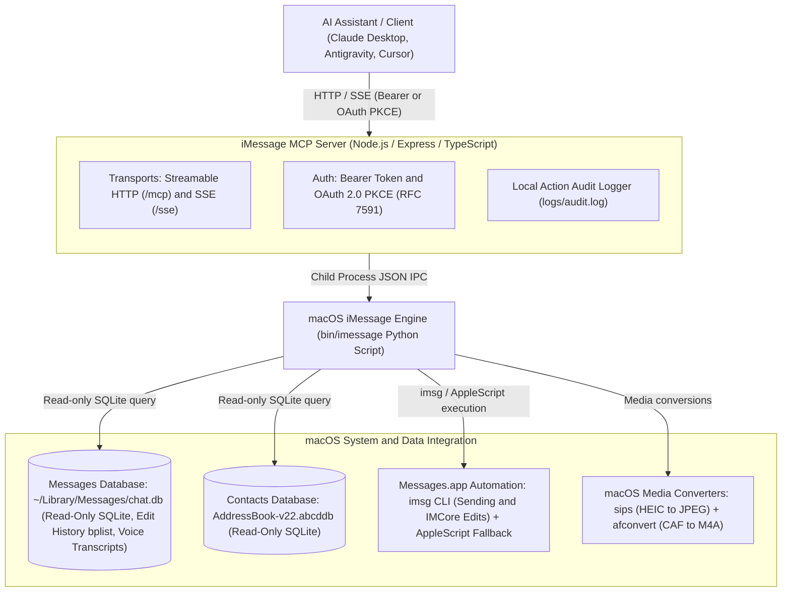

# iMessage MCP Server

[](LICENSE)
[](package.json)
[](https://modelcontextprotocol.io)

An enterprise-grade Model Context Protocol (MCP) Server for macOS iMessage integration over Streamable HTTP and SSE transports.

It connects your local Mac's iMessage database (`~/Library/Messages/chat.db`), macOS Contacts (`AddressBook`), and Swift/AppleScript automation capabilities directly to AI assistants (Antigravity, Claude Desktop, Cursor, Gemini CLI, etc.) running locally or over secure tunnels (Cloudflare Tunnel, Tailscale).

---

## Features

- **Dual MCP Transports:** Supports modern Streamable HTTP (`/mcp`) and Server-Sent Events (`/sse`).
- **Full-Text Message Search:** Instant SQLite query across historical iMessage text and rich attributed bodies.
- **Message Rewrite & Edit History:** Surfaces edit status indicators (`is_edited`, `has_edits`, `edit_count`, `last_edited`) on pulled messages, decoding binary property lists (`message_summary_info`) in `chat.db` for full chronological revision histories.
- **Incremental reads:** `since_msg_id` returns only rows in that chat with a greater message ROWID, so a poller can advance with `next_since_msg_id` instead of re-reading an overlapping window.
- **Link previews:** Shared links (Spotify and other URL balloons) include `link_preview` with url, title, subtitle, artist, and site name. The raw `.pluginPayloadAttachment` stays on `attachments`.
- **Structured tapbacks:** Love, like, dislike, laugh, emphasize, question, and custom emoji reactions are nested on the target message (or listed separately). They are not returned as "Loved …" text.
- **Zoned timestamps:** Each message keeps its human `timestamp` and adds `timestamp_iso` in ISO 8601 with the server machine's local UTC offset.
- **Sender identity:** Outgoing rows use sender `Me` and an empty `handle`. The other party's handle is `participant`, because `chat.db` stores that handle on `is_from_me` rows.
- **Delivery & Read Receipts:** Surfaces `is_delivered`, `delivered_at`, `delivered_at_iso`, `is_read`, `read_at`, and `read_at_iso` on message records. Read receipts on outgoing rows indicate that the recipient has read receipts enabled.
- **Webhook Wakeups & Change Watcher:** Detects changes to `chat.db` and `chat.db-wal` using filesystem events and polling fallback, sending debounced webhook notifications to external bots. Payloads contain strictly event metadata with zero message text or contact names. Includes HMAC-SHA256 signatures and restart state persistence.
- **MCP Resource Subscriptions:** Exposes `resource://messages/recent` with live updates over MCP for clients subscribed to server resources.
- **Message Editing:** Programmatically edit sent messages within Apple's 15-minute protocol window (up to 5 revisions) via `imessage_edit_message` and `imessage edit`, routing through the IMCore bridge.
- **Contact Resolution:** Integrates with macOS Contacts database (`AddressBook-v22.abcddb`) to resolve names, phone numbers, and emails.
- **Voice Note Transcriptions & Audio Processing:** Surfaces Apple on-device speech-to-text transcriptions, audio durations (e.g. `[voice note, 15s: "transcript"]`), and full-text search across voice memo transcripts. Automatically converts proprietary CoreAudio `.caf` files to universal `.m4a` (AAC) via macOS `afconvert` for speech and multimodal AI models.
- **Multimodal Attachment Reading:** Exposes attachment metadata (MIME type, size, path, duration) and automatically converts `.heic` photos to `.jpg` and `.caf` voice memos to `.m4a`.
- **Reliable Attachment Sending:** Sends route through the [imsg](https://github.com/openclaw/imsg) CLI when installed, with a native AppleScript fallback that stages files inside Messages' own attachments directory to avoid "Not Delivered" sandboxing failures. No Accessibility/GUI scripting required.
- **Group Chat Rosters:** Inspects group conversation member lists and handles.
- **OAuth 2.0 Auth Server & Bearer Auth:** Embedded authorization server supporting RFC 8414 metadata, Authorization Code flow with PKCE, Client Credentials grant, and RFC 7591 dynamic client registration alongside customizable static Bearer tokens.

---

## Architecture Overview



```
┌─────────────────────────┐          HTTP / SSE           ┌──────────────────────────────────┐
│  AI Assistant / Client  │  ───────────────────────────> │       iMessage MCP Server        │
│  (Claude, Antigravity)  │  <── Authorization: Bearer ── │     (Node.js / Express / TS)     │
└─────────────────────────┘                               └─────────────────┬────────────────┘
                                                                            │
                                                                            │ Child Process (JSON IPC)
                                                                            ▼
                                                          ┌──────────────────────────────────┐
                                                          │        macOS iMessage CLI        │
                                                          │   (bin/imessage Python Script)   │
                                                          └─────────────────┬────────────────┘
                                                                            │
                            ┌───────────────────────────────────────────────┼───────────────────────────────────────────────┐
                            │                                               │                                               │
                            ▼                                               ▼                                               ▼
             ┌──────────────────────────────┐                ┌──────────────────────────────┐                ┌──────────────────────────────┐
             │   Messages DB (Read-Only)    │                │   Contacts DB (Read-Only)    │                │   Messages.app Automation    │
             │  ~/Library/Messages/chat.db  │                │    AddressBook-v22.abcddb    │                │    imsg CLI + AppleScript    │
             │ • History & Edit bplists     │                │ • Contact & Name Resolution  │                │ • Sending & IMCore Edits     │
             │ • Voice Memo Transcriptions  │                │                              │                │ • sips / afconvert tools     │
             └──────────────────────────────┘                └──────────────────────────────┘                └──────────────────────────────┘
```

---

## Prerequisites

- **Host Machine:** macOS 12 (Monterey), 13 (Ventura), 14 (Sonoma), or 15 (Sequoia).
- **Node.js:** `>=24.0.0` (Active LTS).
- **Package Manager:** `pnpm` (`npm install -g pnpm`).
- **Python:** Python 3.9+ (built-in macOS python3 or Homebrew).
- **Messages App:** Signed into an active Apple ID / iMessage account.

---

## Installation & Setup Guide

### 1. Clone & Install Dependencies

```bash
git clone https://github.com/genericService/imessage-mcp-server.git
cd imessage-mcp-server
pnpm install
```

### 2. Configure Environment & Bearer Token

Create a `.env` file in the project root:

```bash
cp .env.example .env
```

Edit `.env` to set your desired port and a strong random Bearer token:

```env
PORT=8765
AUTH_TOKEN=your-secure-random-bearer-token-here
USE_HTTPS=false
```

### 3. Grant macOS TCC & System Permissions

Due to macOS privacy safeguards (TCC), the process executing the server requires Full Disk Access and Accessibility permissions.

#### A. Full Disk Access (Required to read `chat.db`)
1. Open **System Settings → Privacy & Security → Full Disk Access**.
2. Enable the toggle for **Terminal** (or **sshd-daemon** if running remotely over SSH).

#### B. Automation (Required for sending and editing)
1. Open **System Settings → Privacy & Security → Automation** and ensure **Terminal** / **sshd** has permission to control **Messages**.
2. (Recommended) Install the [imsg](https://github.com/openclaw/imsg) CLI for the primary send path: `brew install steipete/tap/imsg`. Without it, sends fall back to native AppleScript with sandbox-safe attachment staging. Note: `imsg` also powers the private IMCore bridge into Messages.app for editing sent messages.

### 4. Build & Start Server

```bash
# Build TypeScript
pnpm build

# Run in production mode
pnpm start
```

---

## Client Configuration (`mcp_config.json`)

To connect an AI client (Antigravity, Cursor, Claude Desktop, etc.) to the iMessage MCP server:

### 1. Native Direct HTTP Transport (Recommended)

Modern MCP clients support direct HTTP / SSE transport definitions with custom headers (Bearer token & Cloudflare Access tokens) without any external bridge process:

```json
{
  "mcpServers": {
    "imessage": {
      "url": "https://imessage.genericservice.app/mcp",
      "headers": {
        "Authorization": "Bearer YOUR_AUTH_TOKEN",
        "CF-Access-Client-Id": "YOUR_CLIENT_ID.access",
        "CF-Access-Client-Secret": "YOUR_CLIENT_SECRET"
      }
    }
  }
}
```

### 2. Local Network (Direct HTTP)

```json
{
  "mcpServers": {
    "imessage": {
      "url": "http://localhost:8765/mcp",
      "headers": {
        "Authorization": "Bearer YOUR_AUTH_TOKEN"
      }
    }
  }
}
```

### 3. Legacy `mcp-remote` Stdio Bridge (Optional)

If your client only supports `stdio` command execution:

```json
{
  "mcpServers": {
    "imessage": {
      "command": "pnpm",
      "args": [
        "dlx",
        "mcp-remote",
        "https://imessage.genericservice.app/mcp",
        "--header",
        "Authorization: Bearer YOUR_AUTH_TOKEN"
      ],
      "trust": true
    }
  }
}
```

---

## OAuth 2.0 Auth Server (CLI & Online Agents)

The server embeds a native **OAuth 2.0 Authorization Server** supporting RFC 8414 metadata, Client Credentials grant, and Authorization Code grant with PKCE for CLI tools (Claude Code, Antigravity CLI, Codex) and online services (ChatGPT Actions, custom GPTs, web apps).

### 1. Server Metadata Endpoint
* **Discovery URL:** `https://imessage.genericservice.app/.well-known/oauth-authorization-server`
* **Authorization Endpoint:** `https://imessage.genericservice.app/oauth/authorize`
* **Token Endpoint:** `https://imessage.genericservice.app/oauth/token`
* **Registration Endpoint:** `https://imessage.genericservice.app/oauth/register`

### 2. Zero-Config Client Connection (RFC 7591 Dynamic Registration)
Clients supporting RFC 7591 (such as Gemini Desktop or Cursor) connect automatically without requiring manually provisioned client IDs or secrets:
1. Provide the MCP server URL (`https://imessage.genericservice.app/mcp`) in the client.
2. The client discovers `registration_endpoint` and automatically registers its own identity using PKCE (`token_endpoint_auth_method: none`).
3. The client opens your browser to `/oauth/authorize` for logon approval.

### 3. Browser Logon & Session Persistence
The authorization endpoint provides a browser logon screen:
* Log in with `AUTH_USERNAME` and `AUTH_PASSWORD` (or your master `BEARER_TOKEN`).
* Checking **"Remember this browser"** issues a signed, 30-day `HttpOnly` session cookie (`imessage_session`).
* Subsequent client connections from that browser only require a single **"Approve"** click without re-typing credentials.
* To clear sessions, navigate to `/oauth/logout`.

### 4. Client Credentials Token Exchange (CLI & Headless Agents)
Agents can exchange `client_id` and `client_secret` for a signed HS256 JWT access token:

```bash
curl -X POST https://imessage.genericservice.app/oauth/token \
  -H "Content-Type: application/json" \
  -d '{
    "grant_type": "client_credentials",
    "client_id": "antigravity-cli",
    "client_secret": "YOUR_SERVICE_SECRET"
  }'
```

Returns:
```json
{
  "access_token": "eyJhbGciOiJIUzI1Ni...",
  "token_type": "Bearer",
  "expires_in": 3600,
  "refresh_token": "ref_5ae1f64eb91...",
  "scope": "imessage:all"
}
```

---

## Available MCP Tools

| Tool Name | Description | Key Parameters |
| :--- | :--- | :--- |
| `imessage_list_chats` | List recent conversations with AddressBook names and participant sets | `limit` (number, default: 30) |
| `imessage_read_messages` | Read message history with attachments, link previews, tapbacks, voice notes, edit history, and ISO timestamps | `chat` or alias `chat_id` (numeric ROWID from `imessage_list_chats`, or a name/phone/email), `days` (default: 14), `since_msg_id`, `reactions`, `include_calls`, `with_meta` |
| `imessage_get_recent_messages` | Preview the last N messages, or poll rows newer than `since_msg_id` | `chat` or `chat_id`, `limit` (default: 5, max: 50), `since_msg_id`, `reactions` (`attach` or `separate`), `include_filtered`, `include_calls`, `with_meta` |
| `imessage_get_call_history` | Retrieve phone and FaceTime call history with direction, duration, and status | `handle` (or `contact`), `chat` (or `chat_id`), `since`, `until`, `call_type`, `limit` (default: 30) |
| `imessage_search_messages` | Full-text search across historical iMessages and voice note transcriptions, optionally only after a message id | `query` (aliases `q`, `search`), `limit` (default: 30), `since_msg_id` |
| `imessage_get_edit_history` | Retrieve full rewrite and edit history with revision timestamps for an iMessage by ROWID | `message_id` (number, required) |
| `imessage_search_group_chats` | Exact participant set search across group chats | `participants` (array of strings, required) |
| `imessage_search_contacts` | Search macOS Address Book by name, phone, or email | `query` (string, optional) |
| `imessage_get_chat_members` | List members and resolved contact names in group chats | `chat` (string, required) |
| `imessage_get_attachment_payload` | Fetch attachment metadata and base64 payload (converts HEIC to JPEG and CAF voice notes to M4A with transcriptions) | `path` (string, required) |
| `imessage_send_message` | Send iMessage to contact, group chat thread, or chat ROWID (supports dry_run preview & confirm_token) | `recipient` (string, required), `message`, `attachment`, `dry_run`, `confirm_token` |
| `imessage_edit_message` | Edit a previously sent message by ROWID (subject to 15-minute Apple protocol window and 5-edit limit) | `message_id` (number, required), `text` (string, required) |
| `imessage_get_readme` | Retrieve full server README documentation & usage guide | *(none)* |

---

## CLI Reference (`bin/imessage`)

The underlying Python engine can be executed directly as a standalone CLI for local administration, scripting, or automated pipelines. All commands support the `--json` flag for structured machine-readable output:

| Command | Description | Example |
| :--- | :--- | :--- |
| `list` | List recent conversations with participant handles | `bin/imessage list --limit 10 --json` |
| `read` | Read chat history for a contact or group chat | `bin/imessage read 46 --days 7 --since-msg-id 1200 --include-calls --json` |
| `recent` | Preview last N messages, or rows after a message id | `bin/imessage recent 46 --limit 5 --since-msg-id 1200 --include-calls --with-meta --json` |
| `calls` | Retrieve phone and FaceTime call history | `bin/imessage calls --limit 20 --json` |
| `search` | Search message history by keyword or phrase | `bin/imessage search "Arrakis" --limit 20 --since-msg-id 1200` |
| `edits` | Inspect complete rewrite and revision history for a message | `bin/imessage edits 198097 --json` |
| `edit` | Edit a previously sent outgoing message | `bin/imessage edit 198097 --text "Paul Atreides revised" --json` |
| `send` | Send message or attachment to contact or chat ID | `bin/imessage send "+15550199808" --message "Hello" --dry-run` |
| `contacts` | Search AddressBook contacts by name, email, or phone | `bin/imessage contacts "Paul Atreides" --json` |
| `members` | List members and handles in a group chat | `bin/imessage members 1767 --json` |
| `search-group` | Search group chats by exact participant set | `bin/imessage search-group "paul@caladan.org" "chani@sietch.net"` |
| `attachment` | Inspect attachment file metadata and base64 payload | `bin/imessage attachment "~/Library/Messages/Attachments/..."` |
| `changes` | Query message ROWIDs and receipt transitions since cursor | `bin/imessage changes --since-id 1200 --json` |

---

## Security & Local Action Audit Logging

To maintain absolute privacy and trauma-informed data autonomy, the server **never** stores or logs personal message text, passwords, or attachment bytes.

If you wish to log AI agent action executions for security auditing, set `ENABLE_AUDIT_LOG=true` in your `.env` file. This appends structured JSON audit lines to `logs/audit.log`:

```json
{
  "timestamp": "2026-07-25T00:46:45Z",
  "tool": "imessage_send_message",
  "target": "Chani (+15550199480)",
  "dry_run": true,
  "status": "success",
  "duration_ms": 42
}
```

---

## Reading messages

`chat` and `chat_id` are the same parameter. Pass the numeric chat ROWID from `imessage_list_chats` (`rowid`, also copied to `chat_id`). A display name, phone number, or email still matches when you do not have the ROWID yet. `since_message_id` and `after_id` are accepted aliases for `since_msg_id`.

Polling a busy thread:

1. Call `imessage_get_recent_messages` with `with_meta: true`.
2. Store `next_since_msg_id` from the response (it is also on each message).
3. On the next poll, pass that value as `since_msg_id`. The read is `message.ROWID > cursor` inside that chat, not a rescan of the last N texts.
4. When `has_more` is true, call again immediately with the new cursor. With `since_msg_id` set, `limit` counts raw rows, including tapbacks, so a burst cannot hide later texts.

Default JSON stays an array of messages. `with_meta: true` wraps it:

```json
{
  "messages": [],
  "filtered": { "reaction": 2 },
  "next_since_msg_id": 1204,
  "has_more": false
}
```

`filtered.reaction` is how many tapback rows were omitted from `messages` because they were attached to a target. `skipped_before` on each message is the same count since the previous returned row. A missing ROWID that was never stored (a deleted row, for example) is not included in that count. `include_filtered: true` or `reactions: "separate"` puts those rows back in id order as `kind: "reaction"` records with `text: null`.

Outgoing messages (`is_from_me`) use `sender: "Me"` and `handle: ""`. `participant` is the other handle `chat.db` stored on that row. Incoming messages keep the sender handle in both `handle` and `participant`.

### Delivery and Read Receipts

Every message record includes delivery and read receipt indicators:
- `is_delivered` (boolean): `true` when the message has reached Apple delivery networks or the recipient device.
- `delivered_at` (string | null): Formatted local timestamp of delivery.
- `delivered_at_iso` (string | null): ISO-8601 delivery timestamp with local UTC offset.
- `is_read` (boolean): `true` when the recipient has opened or read the message.
- `read_at` (string | null): Formatted local timestamp when read.
- `read_at_iso` (string | null): ISO-8601 read timestamp with local UTC offset.

On outgoing rows, `read_at` only exists when the recipient has read receipts enabled. Typing indicators are transient in memory and are not stored in SQLite `chat.db`.

`timestamp` is unchanged (`2026-09-25 09:25 PM`). `timestamp_iso` is ISO 8601 with the host's local offset (`2026-09-25T21:25:00-07:00`). Edit revisions include `timestamp_iso` as well.

`link_preview` is `null` unless the row has URL-balloon metadata. The plugin payload file remains an attachment.

Tapback `type` is `love`, `like`, `dislike`, `laugh`, `emphasize`, `question`, or `emoji` (custom emoji in `emoji`). `action` is `added` or `removed`. Each reaction includes `target_msg_id` and `target_guid`. A reaction whose target is outside the current window is returned as its own structured record so a poll does not drop it.

## Call and FaceTime history

Call records are read from macOS Core Data SQLite storage at `~/Library/Application Support/CallHistoryDB/CallHistory.storedata` using read-only URIs (`mode=ro`).

- **Tool `imessage_get_call_history`:** Retrieves call records. Filter by `handle` (phone number, email, or contact name), `chat` (resolves chat participants to their handles), `since`/`until` (ISO 8601 strings, Unix timestamps, or Apple epoch seconds), `call_type` (`phone`, `facetime_video`, `facetime_audio`, or `unknown`), and `limit`.
- **Timeline merging via `include_calls`:** Setting `include_calls: true` on `imessage_read_messages` or `imessage_get_recent_messages` merges phone and FaceTime calls with that chat's participants into the message list in chronological order. Calls appear as entries with `kind: "call"`, `text: null`, and the call metadata.
- **Cursor safety:** Call entries do not have message ROWIDs and do not affect `next_since_msg_id` or `filtered.reaction` counts. Incremental polling via `since_msg_id` advances strictly on message rows.
- **Resilience:** If `CallHistory.storedata` is missing or unreadable due to missing Full Disk Access permissions, the tool returns a non-fatal status object explaining the issue rather than throwing an exception.

---

## Webhook Wakeups & Change Watcher

The server can monitor `chat.db` and `chat.db-wal` for incoming messages, reactions, and receipt transitions, and send debounced HTTP POST notifications to external webhook endpoints. This allows an external agent or bot to wake up on activity and fetch message details via `since_msg_id` without continuous polling.

### Privacy & Payload Design

Webhook payloads contain zero message content, sender names, or contact handles. They carry strictly event metadata and cursors:

```json
{
  "event": "message_in",
  "chat_id": 7,
  "newest_msg_id": 105,
  "count": 1,
  "since_msg_id_hint": 104,
  "occurred_at_iso": "2026-09-26T11:15:00-07:00"
}
```

Upon receiving a webhook, the client calls `imessage_get_recent_messages` using `since_msg_id_hint` to retrieve full content securely.

### Configuration

Enable the watcher by setting `WATCH_ENABLED=true` in `.env` or the environment.

Configure rules using either `WATCH_RULES` (inline JSON string) or `WATCH_CONFIG_FILE` (path to a JSON file, default `~/.imessage-mcp/watch-config.json`):

```json
[
  {
    "webhook_url": "https://bot.example.com/webhook",
    "chats": [7, "+15550199480"],
    "events": ["message_in", "reaction", "read_receipt", "delivered"],
    "debounce_ms": 3000,
    "secret": "your-shared-hmac-secret"
  }
]
```

### Rule Fields

- `webhook_url` (string, required): Endpoint URL to receive POST notifications.
- `chats` (array of numbers or strings, required): List of chat ROWIDs or participant handles to watch. Rules without chats are rejected to prevent broadcast leakage.
- `events` (array of strings, optional): Events to emit. Supported values: `message_in`, `message_out`, `reaction`, `read_receipt`, `delivered`. Defaults to `["message_in", "reaction"]`. Outgoing messages (`message_out`) only fire when explicitly included in `events`.
- `debounce_ms` (number, optional, default: 3000): Debounce window grouping rapid event bursts for a chat into a single aggregated notification with an updated `count` and `newest_msg_id`.
- `secret` (string, optional): Shared secret. When present, each webhook request includes an `X-Signature-SHA256: sha256=<hex>` HMAC signature header.
- `headers` (object, optional): Custom HTTP headers sent on every webhook POST, as a map of header name to string value (for example an `Authorization` key expected by the receiving endpoint). Values must be strings without control characters; a rule whose `headers` is not an object of strings is rejected with a warning naming the offending header. `Content-Type`, `Content-Length`, `Host`, and `X-Signature-SHA256` are reserved and cannot be overridden. Header values are never logged. Works together with `secret`: the HMAC signature header is still added.

Example rule with an `Authorization` header and an HMAC secret:

```json
[
  {
    "webhook_url": "https://bot.example.com/webhook",
    "chats": [7],
    "events": ["message_in", "reaction"],
    "secret": "your-shared-hmac-secret",
    "headers": {"Authorization": "Bearer <key>"}
  }
]
```

Each POST then carries `Content-Type: application/json`, `User-Agent: imessage-mcp-server/<version>`, `Authorization: Bearer <key>`, and `X-Signature-SHA256: sha256=<hex>` (HMAC-SHA256 of the raw JSON body).

Rules are read once at server startup from `WATCH_RULES` or `WATCH_CONFIG_FILE`; restart the server after changing them.

### Event Classification

`message_in` and `message_out` are only emitted for real messages. System rows (`item_type != 0`), group events (`group_action_type != 0`), and empty rows with no text, no `attributedBody` text, and no attachments (the rows that render as `<empty message>` from sender `Unknown`) are skipped. They still advance the cursor. Tapbacks are always classified as `reaction`.

### State Persistence & Resilience

- **State File:** Tracked in `WATCH_STATE_FILE` (default `~/.imessage-mcp/watch-state.json`). It records `last_seen_msg_id` and outgoing receipt statuses so server restarts do not replay past messages or miss offline updates.
- **Filesystem Watcher & Polling:** Uses `fs.watch` on the database directory combined with a fallback interval (`WATCH_POLL_INTERVAL_MS`, default 5000ms) to ensure timely detection even under aggressive macOS SQLite WAL checkpoints.
- **Bounded Retries:** Webhook delivery uses exponential backoff up to 3 retries with a 5000ms request timeout. Delivery errors are logged without payload bodies or secrets, and never crash the server.

### MCP Resource Subscriptions

Clients connected over MCP can also subscribe to `resource://messages/recent`. When new messages land in `chat.db`, the server notifies subscribed clients via standard MCP resource update notifications.

---

### Check on a real Mac after deploy

The fixture database covers the shapes this server parses. A live `chat.db` and `CallHistory.storedata` can still differ:

- Real `chat.db` receipt columns: verify that `is_delivered`, `date_delivered`, `is_read`, and `date_read` match expectations across macOS versions.
- Receipt timing: verify read receipt delivery timing when communicating with recipients who have read receipts enabled.
- Filesystem event delivery: confirm that `fs.watch` picks up SQLite WAL changes on `chat.db-wal` on APFS.
- `payload_data` for a current Spotify (or other) share may be an `NSKeyedArchiver` of `LPLinkMetadata`, a plain binary plist, or a newer specialization class. Confirm `link_preview.url`, `title`, `subtitle` or `artist`, and `site_name` on one real share, and that the `.pluginPayloadAttachment` is still listed under `attachments`.
- Tapback rows should use `associated_message_type` 2000 to 2006 (added) and 3000 to 3006 (removed), with `associated_message_guid` like `p:0/<message guid>`. Custom emoji reactions need the `associated_message_emoji` column (Ventura and later). If a reaction still shows up as text, note the integer type and guid prefix.
- On a 1:1 thread, an `is_from_me` row's `handle_id` points at the other person. Confirm `sender` is `Me`, `handle` is empty, and `participant` is that other handle. Group chats often leave `handle_id` empty on outgoing rows.
- `timestamp_iso` should use the Mac's local offset, including daylight-saving changes.
- Edit history for a real edited message should still list every revision. This build does not change how `message_summary_info` is decoded.
- `CallHistory.storedata`: Confirm Full Disk Access allows reading `CallHistory.storedata`. Check that incoming/outgoing phone calls and FaceTime video/audio calls appear with accurate `duration_seconds` and resolved contact names. Check if cellular iPhone calls appear (requires "Calls on Other Devices" enabled in FaceTime/Phone settings on your iPhone and Mac).

## Known Limitations & Considerations

1. **Host Mac Requirement:** Must run on a physical Mac or macOS VM signed into an active Apple ID.
2. **AppleScript Attachment Sandboxing:** Messages' sandbox blocks reading attachments from arbitrary paths (`/tmp`, `~/Desktop`, ...), which historically surfaced as "Not Delivered". This server avoids it by sending through the imsg CLI (which stages files itself), or in the AppleScript fallback by staging files under `~/Library/Messages/Attachments/imessage-mcp/` first (this folder is not pruned automatically). A logged-in user session is still required for Messages automation.
3. **Read-Only SQLite Access:** Database reads use `URI mode=ro` (`sqlite3.connect('file:chat.db?mode=ro', uri=True)`) to ensure `chat.db` is never locked or corrupted by server reads.
4. **SMS vs iMessage:** Text-only messages fallback gracefully to SMS if the recipient handle is a mobile phone number registered on your iPhone's Text Message Forwarding network.
5. **Message Editing Protocol & Architecture:** macOS 13+ introduced message editing over the iMessage protocol. Editing is subject to Apple protocol limits: only outgoing messages (`is_from_me = 1`) can be edited within 15 minutes of sending, up to a maximum of 5 times. AppleScript does not provide an API to edit messages. Programmatic editing is routed through the `imsg edit` CLI bridge, which interfaces with Apple's private `IMCore` framework (`IMChat editMessageItem:`). Operating `imsg edit` requires System Integrity Protection (SIP) to be disabled for dylib injection (`imsg launch`). If SIP is active or the bridge is not running, the tool returns an actionable diagnostic response.

---

## License

This project is licensed under the [MIT License](LICENSE).
